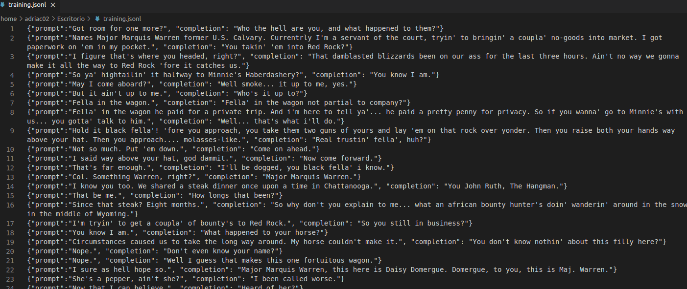
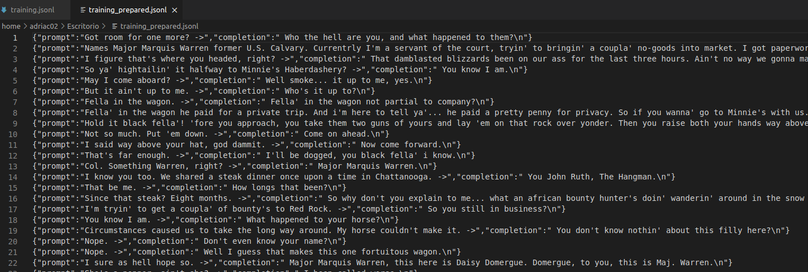
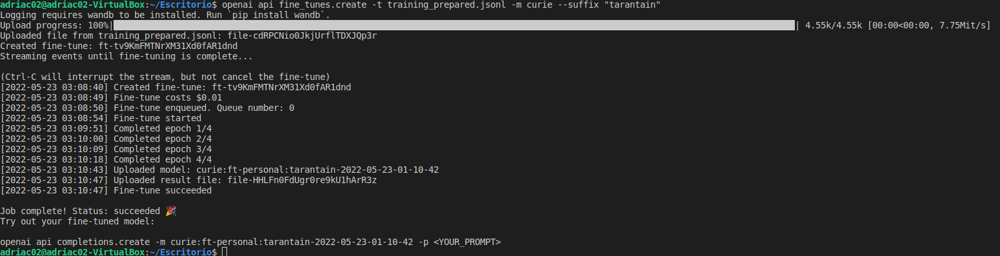
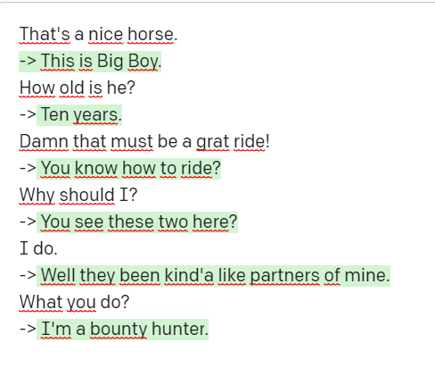
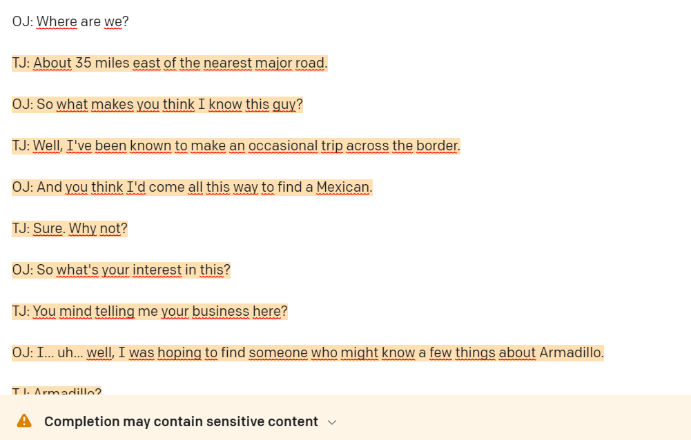

# IAV22-CarrerasBagur

## IDEA DE PROYECTO

Mi idea es crear una IA que utilice el modelo de lenguaje GPT-3, creado por OpenAI para crear un juego con NPCs a los que puedas hablar y respondan de manera
inteligente e independiente.

Pasándole una serie de frases que expliquen al NPC antes de empezar el juego, debería poder tener una historia de Background que refleje en su
personalidad.

Además podría cambiar su comportamiento dentro del juego según lo que le digas.
Ej.: Si le dices al NPC que has escuchado un ruido en una habitación X, el NPC podría evitar esa habitación en el caso de que tenga una personalidad miedosa, 
o ir a ver que sucede si es valiente.

##  Planteamiento del proyecto
Para implementar GPT-3 he encontrado un repositorio en github que facilita la implementación de este en unity: https://github.com/ivomarel/OpenAI_Unity

El proyecto va a tratar del personaje del jugador y el personaje con IA.

El jugador puede interactuar con todo el entorno con un controlador normal que le permita moverse y abrir puertas, examinar objetos, etc. además de un cuadro de
texto que se podrá abrir en cualquier momento en el que esté cerca de la IA para interactuar con esta. La implementación del código de este jugador es más
bien sencilla, con scripts de movimiento y teclas especiales, además de una tecla para abrir el cuadro de texto.

Para que el juego pueda comunicar los dos personajes se va a implementar un GameManager que registre los mensajes de cada uno de ellos para, además de poder
recibir respuestas, la Ia hecha con GPT-3 sea capaz de recordar e interpretar toda la conversación que ha tenido el personaje, con memoria.

La implementación de la IA va a retocarse según necesite la API de OpenAI la cual aún no domino completamente, pero la idea general es la siguiente:

```
clase IA:
  string[] registroMensajes
  GameManager* gM //Para tener referencia al GameManager y poder actuar en consecuencia
  
  void recieveMsg(string) //Aquí recibe e interpreta los mensajes que manda el jugador
  void sendReply(string) //Manda la respuesta al gameManager para que este se la mande al jugador
  void Update() //Teniendo en cuenta el registro de los mensajes y lo que se haya guardado en el gameManager, hacer que por ejemplo evite una zona del mapa
  void insertBG(string[]) //Insertar a la IA una historia de fondo para que el personaje esté realmente metido en el juego y que sepa qué hace ahí y quién es, para crear un rol realista
```

## Memoria API
Al empezar con el proyecto me he encontrado con muchísimos problemas que me han retrasado en las demás tareas que tenía planteadas.

Para empezar he descubierto que la API de OpenAI de GPT3, pese a ser una API abierta, es de pago, he hecho lo que he podido con las herramientas que tenía y lo he conseguido implementar funcionalmente.

Para conseguir esto empecé a pelearme con NuGet, un administrador de paquetes para .NET que jamás había utilizado, aunque me parece muy poderoso. Instalé un paquete que implementaba NuGet en Unity (https://github.com/GlitchEnzo/NuGetForUnity). Aunque este no dió muy buenos resultados.

Al principio todo fueron conflictos entre versiones de los diferentes paquetes que tenía que utilizar, además el paquete de NuGet para Unity duplicaba algunos archivos y hacía que estos quedaran inservibles.

Al final descubrí que podía añadir manualmente las librerías sin necesitar un instalador de paquetes ni nada parecido.

Seguí más o menos este tutorial (https://unitycoder.com/blog/2022/02/05/using-open-ai-gpt-3-api-in-unity/) realizando los cambios que veía necesarios relativos a librerías y versiones, y al final conseguí una IA que completaba el texto que le insertaba.

### Uso final de la api (Apartado de funcionalidad con IA)

`IMPORTANTE: Dado que la API, pese a ser abierta tiene un coste monetario, he conseguido una clave que dejo puesta en el código, esa clave es personal y tiene un límite de operaciones, que se gastan con cada entrada. Por lo que pido por favor el buen uso de ella.`

Al final y tras investigar como se utiliza la API de OpenAI tuve que mejorar considerablemente el planteamiento del código que iba a usar.

A pesar de tener dos personajes distintos con distintas respuestas y personalidad, los dos utilizan exactamente el mismo script, únicamente cambiando algunos de los parámetros que se les pasan.

Además he utilizado paquetes de threading para crear las respuestas, que no quedará reflejado en el pseudocódigo siguiente.

```
clase IA:
  parametros{
    USARMEMORIA
    TEMPERATURA
    HISTORIA
  } //Estos a son los que configuran a la IA para saber cómo se va a comportar

  string[] MEMORIA

  OpenAIAPI api //Referencia a la api

  Start{
    Inicia la API
  }

  ResponderConMemoria{ //No es necesario pasarle un string porque usa la memoria
    string pregunta = HISTORIA + MEMORIA
    string respuesta = api.CreateCompletion(pregunta,parametros)
    ActualizaTexto(respuesta)
  }
  
  Responder(string pregunta){
    string preguntaFinal = pregunta + MEMORIA
    string respuesta = api.CreateCompletion(preguntaFinal,a)
    ActualizaTexto(respuesta)
  }

  ProcesaEntrada(string pregunta){
    if USAMEMORIA{
      pregunta -> MEMORIA
      ResponderConMemoria()
    }
    else{
      Responder(pregunta)
    }
  }
```

Los parámetros que utiliza la API de manera más concreta son:
- Max_Tokens: La cantidad de tokens(letras/palabras) que puede responder.
- Temperature: ``[0.0,1.0]`` El nivel de fidelidad que va a tener en la conversación, donde 0 es parecido a repetir lo que dices, añadiendo pocas palabras. Y 1 es dar respuestas absolutamente desproporcionadas e incongruentes, a la par que interesantes en algunos casos. Es el parámetro con el que más he probado y a mi parecer el más interesante.
- StopSequences: Los carácteres que indican a la API cuando parar de generar la respuesta.
- Penalties: Indican a la API  que palabras o formas le penalizan e intenta reducirlas.

Los mayores problemas que me ha dado la API es a la hora de usar el registro de mensajes con memoria, es muy propensa a provocar bucles sobre todo usando una temperatura baja.

## Memoria Escena (Apartado de funcionalidad del juego)

Empecé una escena vacía y añadí un Trigger que simulaba al personaje con la IA, que te permitía interactuar con él solo cuando estabas dentro de su rango.

Además implementé un jugador simple que se puede mover en todas direcciones con un controlador sencillo.

Lo más interesante del jugador es la capacidad de poder introducir texto dirigido a la IA mediante un TextField en el canvas.

Ha sido añadido una pequeña decoración para amenizar la experiencia en el proyecto, los modelos de los personajes los he hecho yo mismo y lo modelos de árboles y follaje son de sketchfab.

### Personaje 1 (Dios, apartado IA 1)

El primer personaje y con el que empecé la IA, es decir con el que más he estado trabajando es el que se encuentra a tu derecha al empezar.

De manera predeterminada sus parámetros son que no utiliza registro de mensajes, una temperatura de 0.7 y una historia corta de una interacción:
```
- You are God.
- Yes, I am the savior of this place.
```
Tras interactuar bastante con él he visto que tiene respuestas bastante curiosas y vale la pena estar un rato hablándole, el mayor problema que puede tener es el de entrar en un bucle o de escribir mal su respuesta en el texto que tiene encima de su cabeza (normalmente añadiendo algún carácter que no debería).

El personaje puede elegir quedarse callado o puedes obligarle a iniciar él mismo una interacción si no escribes nada en el campo de Input.

### Personaje 2 (Mariposa, apartado IA 2)

Este es el segundo personaje, con el que he interactuado en menor medida, pero que suele tener respuestas más sencillas y coherentes a la hora de hablar. La única diferencia que tiene con el otro personaje es la historia de fondo que se le pasa, siendo esta:

```
- You are a butterfly.
- Yes, I am a beautiful butterfly.
- What is that tree behind you?
- I tried to save it but it died.
```

Aún así sigue el principio que buscaba, de que cada vez que lo juegues tenga una respuesta distinta, sin tener que hacer un larguísimo diccionario o necesitar del mejor guion.

# IMPORTANTE SOBRE MI PROYECTO CON GPT3
## Fine-Tuning (Apartado de entrenamiento de la IA)
La idea inicial que tuve fue entrenar a la IA pasándole varios strings con los que entendía su background, su personalidad etc.

Me he encontrado con muchos problemas por el camino, pero conseguí crear un nuevo motor basado en Curie (uno de los motores base de GPT3), pero este no es compatible con la SDK que estoy utilizando para Unity, así que voy a hacer un video a parte probando ese modelo en la misma página de OpenAI donde sí funciona.

Es un modelo que creé con la finalidad de realizar diálogos de película western, para ello lo entrené con el guion de la película "Los Odiosos Ocho" de Quentin Tarantino.



Después de crear el JSONL de todo el guión, utilizé el Command-Line de OpenAI para crear un archivo de entrenamiento para un modelo que pudiera entender GPT-3.



A partir de aquí seguí usando la Command-Line para finalmente crear el motor curie:ft-personal:tarantain-2022-05-23-01-10-42



A partir de aquí puedo hablar con el bot perfectamente, como un chatbot refinado al extremo con temática Western, aunque realmente ya sabiendo cómo se hace, es cuestión de encontrar una database mayor para refinarlo hacia donde se desee.



También puede generar él solo un guión de película Western.



El mismo OpenAI nos avisa de que contiene contenido sensible, ya que la película con la que ha sido entrenado el motor tiene diálogos con este estilo de palabras.

## Vídeos (Apartado banco de pruebas)

Vídeo del Proyecto Final: https://youtu.be/cE7LXTUWKKk

Vídeo del modelo entrenado por mí: https://youtu.be/9pnBGgKKvBo ``(Este vídeo dura algo más de tres minutos porque a mi parecer es algo a parte del Proyecto Final)``
